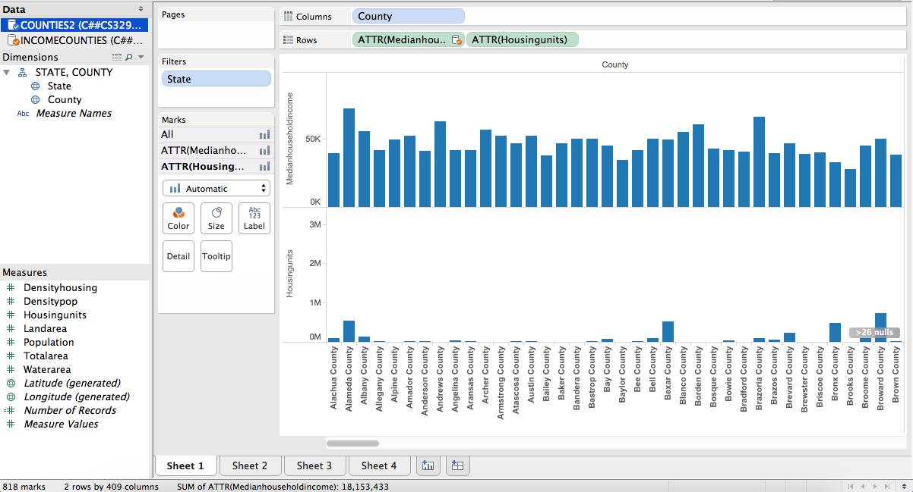
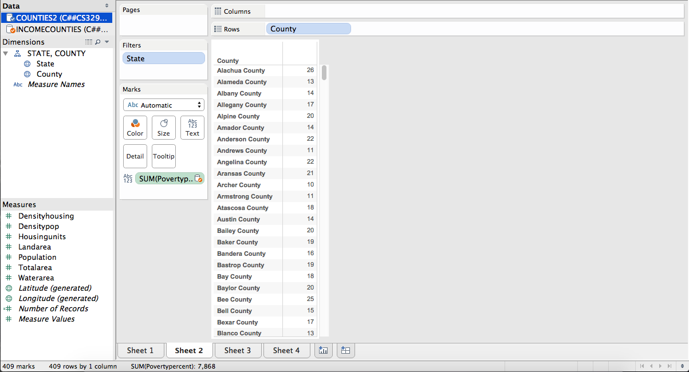
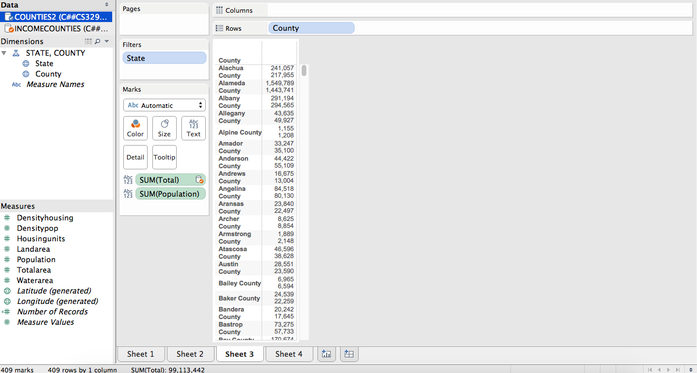
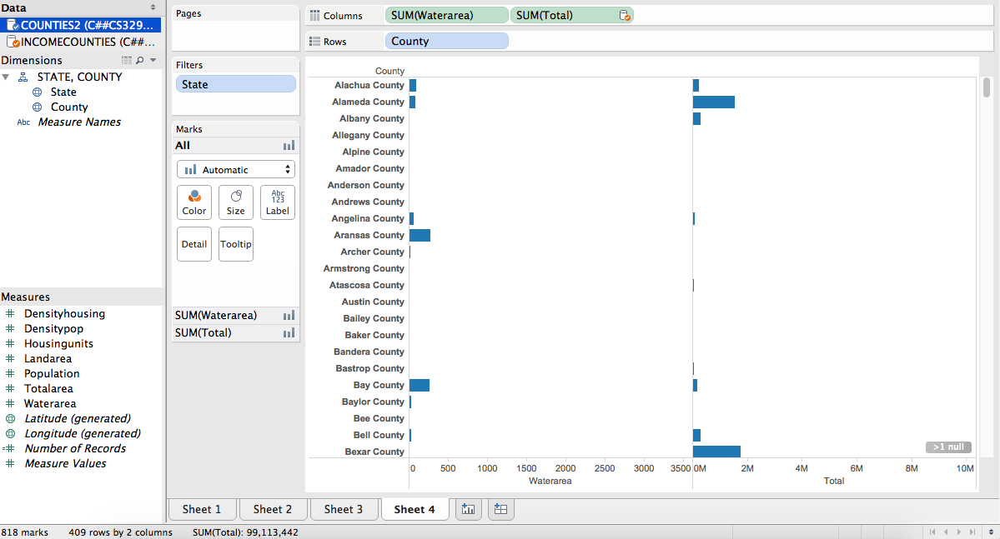

**By: Mitali Sathaye and Saqib Ali**

ONE
----
*For our first visualization we compared the median household income and the number of housing units in each county. After analyzing the data we found that there was no correlation.*

TWO
----
*For our second visualization we measured the percentage of the population for each county that is under the poverty line.*

THREE
----
*For our third visualization we compared the population of each county from both of our data sources to see if there would be a discrepency between the data. We found that there were small differences but they were negligible*

FOUR
----
*For our fourth visualization we wanted to see if there was a correlation for water area and total population within each county. After visualizing the data we found no correlation.*

